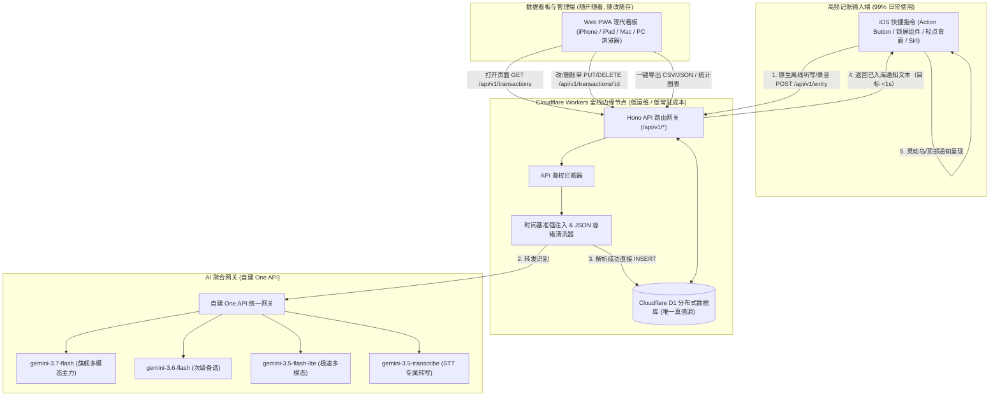
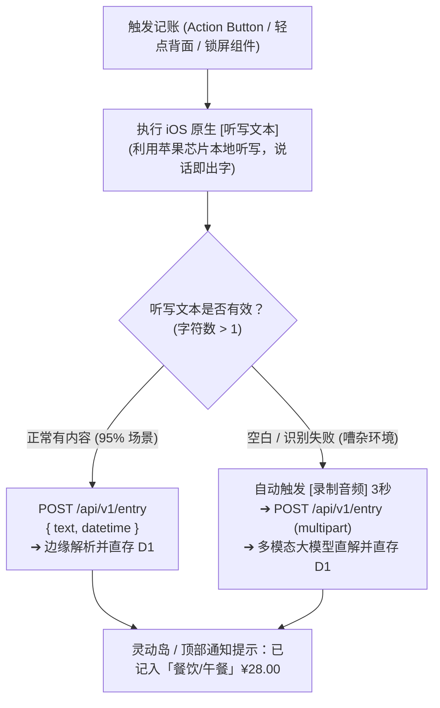
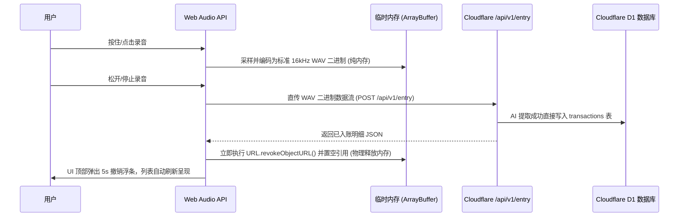

# MyCost 语音输入记账系统：架构规范与实施方案 (SPEC v0.1)

> **文档版本**：V0.1 (Lightweight Cloud-First & Direct D1 Edition)  
> **核心定位**：个人高频使用的极致轻量、低维护、可长期运行的语音记账系统，主打文本优先、音频兜底、单库真值源  
> **运行形态**：**iOS 快捷指令（Shortcuts）全局后台免开界面，主力文本直录** + **Web PWA 跨平台数据看板与维护管理中心**（iPhone/iPad/PC/Mac）  
> **成本与运维**：**低常驻成本、低运维开销**（Cloudflare Workers + Static Assets + Cloudflare D1 + 自建 One API）  
> **核心指标**：文本链路端到端写入 **目标 <1s**；音频兜底链路按 **1.5 ~ 3s** 设计；账单直存云端 D1；音频尽量不落盘、入库后立即释放；数万笔账单保持 MB 级体积。

---

## 目录

1. [系统总体架构与极简拓扑](#1-系统总体架构与极简拓扑)
2. [iOS 快捷指令（Shortcuts）全局极速记账规范](#2-ios-快捷指令shortcuts全局极速记账规范)
3. [Web PWA 客户端架构与音频即用即销毁机制](#3-web-pwa-客户端架构与音频即用即销毁机制)
4. [AI 多模态调度管道与时间容错清洗](#4-ai-多模态调度管道与时间容错清洗)
5. [云端单一真值源（Cloudflare D1）与数据模型](#5-云端单一真值源cloudflare-d1与数据模型)
6. [Web 看板交互与高效管理体验](#6-web-看板交互与高效管理体验)
7. [数据自主权与标准格式导出备份](#7-数据自主权与标准格式导出备份)
8. [Cloudflare Workers 全栈工程与数据库设计](#8-cloudflare-workers-全栈工程与数据库设计)
9. [精简接口规范（API Specification）](#9-精简接口规范api-specification)
10. [实施路线图与测试验收矩阵](#10-实施路线图与测试验收矩阵)
11. [Cloudflare 部署与苹果快捷指令交接说明](#11-cloudflare-部署与苹果快捷指令交接说明)

---

## 1. 系统总体架构与极简拓扑

系统采用 **“Cloudflare Workers 全栈 + Static Assets + Cloudflare D1 单一真值源 + 快捷指令直录 + PWA 随开随审”** 的极简现代架构：



### 核心架构原则
1. **云端单一真值源（Cloud-First Single Truth）**：Cloudflare D1 作为唯一数据库，前端不维护双向同步和冲突合并逻辑，减少状态分叉风险。
2. **快捷指令直接落库**：快捷指令发起请求后，服务端完成 AI 结构化提取并**直接写入 D1**，尽快返回记账结果通知，无需打开前端网页。
3. **PWA 极简看板化**：PWA 作为轻量化管理中心，负责数据可视化看板、明细筛选、补录、修改、删除和数据导出。
4. **幂等、审计与备份**：所有写入带 `request_id`，失败可重试；数据库不是备份，必须配套导出与快照恢复。

---

## 2. iOS 快捷指令（Shortcuts）全局极速记账规范

为追求低延迟与低认知成本，系统采用 **「文本优先、音频兜底」** 的双轨策略。下表耗时均为目标值，实际结果受网络、模型负载和设备状态影响。

### 2.1 智能双轨分工矩阵

| 维度 | 轨道 A：iOS 原生离线听写（首选） | 轨道 B：多模态音频直传（兜底/复杂场景） |
|---|---|---|
| **端到端耗时** | **目标 0.4 ~ 1.0 秒**（先本地听写，再走轻量文本解析与写库） | **目标 1.5 ~ 3.0 秒**（上传音频并由多模态大模型解析） |
| **网络流量** | 仅发送几十字节 JSON 纯文本（省流 99%） | 发送约 30KB~100KB 音频文件 |
| **弱网表现** | **稳定**（离线环境仍可先完成本地听写） | 弱网下可能需要重试上传 |
| **AI 额度消耗** | 仅消耗文本 Token | 消耗多模态音频 Token |
| **定位与适用场景** | **日常单笔记账**（如“早餐包子 6 块”、“打车 35”） | 嘈杂环境、方言口音、长难句多笔复合账单 |

---

### 2.2 快捷指令执行链路设计

#### 链路 1：All-in-One 智能自适应降级指令（全自动首选）



#### 链路 2：推荐系统硬件绑定方案
- **iPhone 15/16 操作按钮（Action Button）**：绑定「极速听写记账」指令，长按直接说话，松手即记入 D1；
- **轻点背面两下（Back Tap）**：绑定备用语音记账；
- **iOS 锁屏小组件**：一键点击弹出麦克风听写。

---

## 3. Web PWA 客户端架构与音频即用即销毁机制

### 3.1 客户端技术选型（轻量无负担）
- **构建框架**：Vite + React 19 + TypeScript
- **样式系统**：现代 Vanilla CSS 设计系统（Sleek OLED 纯黑暗色模式、精选 HSL 色彩、流体响应式排版）
- **数据层**：标准 RESTful Fetch 搭配轻量缓存，无需引入重型本地数据库与同步中间件
- **PWA 支持**：`vite-plugin-pwa`（配置 Web App Manifest、静态资源离线缓存，支持 iOS 全屏 standalone 模式）
- **触感反馈**：调用 Web Haptics API (`navigator.vibrate`)

### 3.2 纯内存音频处理与“即用即销毁”生命周期
若用户在 Web PWA 网页端点击录音记账，确保手机与电脑磁盘空间 **0 泄漏、0 膨胀**：



#### 零依赖 16kHz WAV 转码规范（单文件 ~80 行代码）：
- **采样率**：**16,000 Hz** (下采样兼顾人声清晰度与最小体积，1秒约 32KB)
- **声道数**：单声道 (Mono)
- **采样位深**：16-bit Linear PCM
- **标准头**：纯前端拼接 44 字节标准 RIFF WAV Header，100% 兼容各大下游大模型。

---

## 4. AI 多模态调度管道与时间容错清洗

### 4.1 模型调度矩阵（基于自建 One API，按配置顺序自动降级）

| 优先级 | 模型名称 | 适用接口 | 角色与定位 | 实测延迟 |
|---|---|---|---|---|
| **P1 主力** | `gemini-3.7-flash` | `/v1/chat/completions` (input_audio) | 旗舰多模态直解：最强复杂语义理解与多笔拆解 | ~1.4s |
| **P2 备选** | `gemini-3.6-flash` | `/v1/chat/completions` (input_audio) | 次级多模态：高可用稳定性保障 | ~1.3s |
| **P3 极速** | `gemini-3.5-flash-lite`| `/v1/chat/completions` (input_audio) | 极速轻量多模态：超低延迟与经济配额 | ~1.1s |
| **P4 兜底** | `gemini-3.5-transcribe` + 文本模型 | `/v1/audio/transcriptions` + `chat/completions` | 双阶段降级：转写为文字后再由大模型解析 | ~2.5s |

> 注：模型优先级、失败重试次数和超时阈值应由配置驱动，表中延迟仅作典型值参考，不作为 SLA。

---

### 4.2 客户端时间基准强注入规范
为防止时区错乱和大模型误判相对时间（如“昨天”、“大前天打车”、“上周五买鞋”），服务端在组装 Prompt 时强制注入客户端本地时间基准：

```typescript
export function buildSystemPrompt(clientDateTime: string, weekday: string): string {
  return `你是一个专业严谨的记账助手。请从用户输入的文本或语音中提取财务交易信息，严格输出纯 JSON。

【当前基准时间】
- 客户端当前时间：${clientDateTime} (星期${weekday})
- 请根据此基准时间精准计算相对日期（如“昨天”、“前天”、“上周日”），输出交易发生的真实日期 (YYYY-MM-DD)。

【分类标准库】
餐饮(早餐/午餐/晚餐/咖啡饮料/零食水果), 交通(打车/地铁公交/加油/停车), 购物(超市买菜/日用品/服饰数码), 娱乐, 居家, 医疗, 人情, 收入(工资/理财/兼职), 其它。`;
}
```

---

### 4.3 鲁棒 JSON 提取与容错清洗器
彻底消除大模型可能返回的 ` ```json ... ``` ` 等 Markdown 干扰符号：

```typescript
export function cleanAndParseJSON<T>(rawContent: string): T {
  let cleaned = rawContent.trim();
  // 剥离 Markdown 代码块包裹
  if (cleaned.startsWith('```')) {
    cleaned = cleaned.replace(/^```(?:json)?\s*/i, '').replace(/\s*```$/i, '').trim();
  }
  return JSON.parse(cleaned) as T;
}
```

---

### 4.4 结构化输出 JSON Schema
```json
{
  "name": "expense_extraction",
  "strict": true,
  "schema": {
    "type": "object",
    "properties": {
      "transcript": { "type": "string", "description": "原始转写或输入文本" },
      "transactions": {
        "type": "array",
        "items": {
          "type": "object",
          "properties": {
            "type": { "type": "string", "enum": ["expense", "income"] },
            "amount": { "type": "number", "description": "交易金额" },
            "currency": { "type": "string", "default": "CNY" },
            "category": { "type": "string", "description": "一级分类" },
            "subcategory": { "type": ["string", "null"], "description": "二级子分类" },
            "merchant": { "type": ["string", "null"], "description": "商家/收款方" },
            "payment_method": { "type": ["string", "null"], "description": "微信支付/支付宝/信用卡等" },
            "transaction_date": { "type": "string", "description": "交易发生日期 YYYY-MM-DD" },
            "description": { "type": ["string", "null"] }
          },
          "required": ["type", "amount", "currency", "category", "transaction_date"],
          "additionalProperties": false
        }
      }
    },
    "required": ["transcript", "transactions"],
    "additionalProperties": false
  }
}
```

---

## 5. 云端单一真值源（Cloudflare D1）与数据模型

### 5.1 数据模型（Transactions）
数据库层统一存整数分；API 层只返回格式化后的元值。
```typescript
export interface Transaction {
  id: string;              // UUIDv4
  request_id: string | null; // 幂等键，快捷指令或 PWA 生成
  type: 'expense' | 'income';
  amount_cents: number;    // 整数分，禁止浮点
  currency: string;        // 默认 'CNY'
  category: string;
  subcategory: string | null;
  merchant: string | null;
  payment_method: string | null;
  transaction_date: string; // YYYY-MM-DD
  description: string | null;
  raw_text: string;        // 原始输入文本
  source: 'shortcuts' | 'pwa_voice' | 'pwa_text' | 'manual';
  parse_status: 'parsed' | 'pending' | 'failed';
  model_name: string | null;
  confidence: number | null;
  is_deleted: 0 | 1;       // 软删除标记
  deleted_at: string | null;
  created_at: string;      // ISO 8601 UTC
  updated_at: string;      // ISO 8601 UTC
}
```

---

## 6. Web 看板交互与高效管理体验

Web PWA 主要作为日常财务概览、明细维护与深度分析的工作台：

### 6.1 核心管理功能
1. **月度收支概览**：动态计算当月总支出、总收入、结余与日均花销；
2. **多维分类饼图与趋势折线图**：直观呈现各类开销占比与消费走势；
3. **明细流与即时维护**：
   - 支持按月份、分类、关键词检索；
   - 点击任意条目即席修改金额、分类、日期、备注；
   - 支持一键删除（软删除），云端 D1 秒级同步更新。
4. **网页端极速补记**：
   - 保留顶部快捷输入栏（支持文字或按住录音），输入后直接写入 D1 并刷新列表；
   - 提供 5 秒撤销浮条（Toast），误记一键撤回。

---

## 7. 数据自主权与标准格式导出备份

### 7.1 标准格式无损导出
- **CSV 通用表格**：按照通用财务标准导出（`日期, 类型, 金额, 币种, 一级分类, 二级分类, 商户, 支付方式, 备注, 原始识别文本`），直接兼容 **钱迹、随手记、网易有钱** 及 Excel / Apple Numbers 分析；
- **JSON 全量快照**：一键导出全库账单与设置，便于异地归档；
- **定时备份**：至少保留每日一次 D1 快照或导出文件，防止在线库异常时无法恢复。

---

## 8. Cloudflare Workers 全栈工程与数据库设计

### 8.1 统一工程目录结构
```text
mycost/
├── worker/                        # Cloudflare Worker 入口
├── functions/                     # API 和 D1 业务模块
│   └── api/
│       └── v1/
│           ├── [[route]].ts       # Hono 路由入口
│           ├── ai.ts              # One API 统一调度与 JSON 提取清洗
│           ├── db.ts              # D1 数据库 CRUD 封装
│           └── middleware.ts      # Bearer Token / 可选 Passkey 鉴权中间件
├── src/                           # PWA 前端应用 (Vite + React 19)
│   ├── components/                # 现代 UI 组件
│   │   ├── DashboardStats.tsx     # 收支统计与趋势图表
│   │   ├── TransactionList.tsx    # 交易列表与即席编辑抽屉
│   │   ├── QuickInputBar.tsx      # 网页端快速补录与录音条
│   │   └── ExportModal.tsx        # CSV / JSON 导出弹窗
│   ├── services/
│   │   ├── api.ts                 # REST API 请求封装
│   │   └── audioRecorder.ts       # 16kHz WAV 纯内存录音机 (<80行)
│   ├── styles/                    # Vanilla CSS 设计系统 (tokens.css, app.css)
│   ├── App.tsx
│   └── main.tsx
├── public/
│   ├── manifest.json              # PWA Manifest
│   ├── icon-192.png
│   └── icon-512.png
├── schema.sql                     # Cloudflare D1 初始建表脚本
├── wrangler.toml                  # Cloudflare Worker / Assets / D1 配置
├── package.json
└── tsconfig.json
```

---

### 8.2 Cloudflare D1 建表脚本 (`schema.sql`)
```sql
-- 1. 交易明细表 (Transactions)
CREATE TABLE IF NOT EXISTS transactions (
    id TEXT PRIMARY KEY,
    request_id TEXT UNIQUE,
    type TEXT NOT NULL CHECK (type IN ('expense', 'income')),
    amount_cents INTEGER NOT NULL,
    currency TEXT NOT NULL DEFAULT 'CNY',
    category TEXT NOT NULL,
    subcategory TEXT,
    merchant TEXT,
    payment_method TEXT,
    transaction_date TEXT NOT NULL,   -- YYYY-MM-DD
    description TEXT,
    raw_text TEXT NOT NULL,           -- 原始识别/输入文本
    source TEXT NOT NULL DEFAULT 'shortcuts',
    parse_status TEXT NOT NULL DEFAULT 'parsed',
    model_name TEXT,
    confidence REAL,
    is_deleted INTEGER NOT NULL DEFAULT 0,
    deleted_at TEXT,
    created_at TEXT NOT NULL,         -- ISO 8601 UTC
    updated_at TEXT NOT NULL          -- ISO 8601 UTC
);

CREATE INDEX IF NOT EXISTS idx_trans_date ON transactions(transaction_date);
CREATE INDEX IF NOT EXISTS idx_trans_deleted ON transactions(is_deleted);
CREATE INDEX IF NOT EXISTS idx_trans_request_id ON transactions(request_id);

-- 2. 自定义分类表 (Categories)
CREATE TABLE IF NOT EXISTS categories (
    id TEXT PRIMARY KEY,
    name TEXT NOT NULL,
    type TEXT NOT NULL CHECK (type IN ('expense', 'income')),
    icon TEXT,
    subcategories TEXT,               -- JSON Array 字符串
    sort_order INTEGER NOT NULL DEFAULT 0,
    is_deleted INTEGER NOT NULL DEFAULT 0,
    updated_at TEXT NOT NULL
);

-- 3. 系统动态配置表 (Settings)
CREATE TABLE IF NOT EXISTS settings (
    key TEXT PRIMARY KEY,
    value TEXT NOT NULL,
    updated_at TEXT NOT NULL
);
```

---

## 9. 精简接口规范（API Specification）

快捷指令与脚本调用使用 Bearer Token；PWA 管理端可单独启用 WebAuthn / Passkey，不和快捷指令混用。先保留单一鉴权头，别把认证体系做重。
```http
Authorization: Bearer <APP_PASSKEY>
```

### 9.1 统一记账直录接口：`POST /api/v1/entry`
快捷指令或 PWA 发送文本或音频，服务端完成 AI 解析后直接写入 D1。写入必须幂等，重复 `request_id` 只落一次库。响应体可保留元级展示值，内部落库统一使用 `amount_cents`。

- **Content-Type**: `application/json` 或 `multipart/form-data`
- **请求字段**：
  - `request_id`: 幂等键，建议由客户端生成 UUID
  - `text`: 文本字符串（如 `打车花了35元，微信支付`）
  - `audio`: 音频二进制文件（可选，WAV 或 m4a）
  - `datetime`: 客户端本地时间（如 `2026-09-01T17:15:00+08:00`）
  - `source`: `shortcuts` | `pwa_voice` | `pwa_text`
- **返回响应 (200 OK)**：
  ```json
  {
    "status": "SUCCESS",
    "message": "已记入「交通/打车」¥35.00",
    "transcript": "打车花了35元，微信支付",
    "transactions": [
      {
        "id": "c1f76f45-0d2e-4b47-b8d1-13cb24f8d9b1",
        "request_id": "3f4c6b1d-2f0a-4c4b-9b38-4f3d9ef4e7aa",
        "type": "expense",
        "amount": 35.0,
        "currency": "CNY",
        "category": "交通",
        "subcategory": "打车",
        "merchant": null,
        "payment_method": "微信支付",
        "transaction_date": "2026-09-01",
        "description": "打车"
      }
    ],
    "execution_time_ms": 620
  }
  ```

---

### 9.2 交易明细查询接口：`GET /api/v1/transactions`
- **Query 参数**：
  - `month`: 可选，如 `2026-09`（查询当月所有账单）
  - `category`: 可选分类筛选
  - `limit`: 默认 100
- **返回响应**：`{ "transactions": [...], "total_expense": 2450.0, "total_income": 12000.0 }`

---

### 9.3 交易修改与删除：`PUT /api/v1/transactions/:id` & `DELETE /api/v1/transactions/:id`
- `PUT`: 传入更新字段 JSON，修改金额/分类/备注并更新 `updated_at`；
- `DELETE`: 执行软删除（更新 `is_deleted = 1`）。

---

### 9.4 全量数据导出：`GET /api/v1/export`
- **Query 参数**：`?format=csv` 或 `?format=json`
- **响应**：直接返回 `Content-Disposition: attachment; filename="mycost_export_20260901.csv"` 文件流。

---

## 10. 实施路线图与测试验收矩阵

### 10.1 实施路线图

```text
阶段 1：全栈脚手架与 D1 数据库构建 (Day 1)
  • 初始化 Vite + React 19 + TypeScript + Cloudflare Worker Static Assets
  • 配置 wrangler.toml 与 Cloudflare D1 建表 (schema.sql)
  • 实现 Hono 路由框架与 Bearer 鉴权中间件

阶段 2：AI 调度清洗与 /api/v1/entry 直录接口 (Day 2)
  • 接入自建 One API (配置化模型池调度，按优先级自动降级)
  • 实现客户端时间上下文强注入与 Markdown/JSON 容错清洗
  • 实现服务端直存 D1，并返回快捷指令专用精简提示文案

阶段 3：Web PWA 看板界面与 CRUD 管理交互 (Day 3)
  • 构建现代 OLED 纯黑极简设计系统 (Vanilla CSS)
  • 实现月度收支汇总卡片、分类图表与交易明细列表
  • 实现即席编辑、快速删除与纯内存 16kHz WAV 补录组件

阶段 4：iOS 快捷指令集成与端到端联调验收 (Day 4)
  • 编写并导出 iOS 快捷指令配置分享链接（支持 Action Button 绑定）
  • 完善 CSV / JSON 导出功能
  • 全流程真实记账与容错测试
```

---

### 10.2 测试验收矩阵

| 用例 ID | 测试场景 | 输入与操作 | 预期验收结果 |
|---|---|---|---|
| **T01** | 快捷指令极速直录 | 长按 iPhone Action Button 说出：“中午吃牛肉面 28 块” | 目标 <1.5s 入库 D1，灵动岛/通知栏弹出“已记入「餐饮/午餐」¥28.00”，免开网页 |
| **T02** | 快捷指令多笔拆解 | 语音：“买咖啡18，晚上超市买菜65” | 自动在 D1 插入 2 笔记录，通知栏提示“已记入 2 笔共 ¥83.00” |
| **T03** | 相对时间准确解析 | 周二晚上说：“昨天打车花了32” | `transaction_date` 准确记录为周一的日期，无时区偏差 |
| **T04** | Web PWA 看板管理 | 在浏览器中打开 PWA 页面 | 自动拉取最新账单列表与月度统计；支持即席修改金额与一键删除 |
| **T05** | 数据自主导出 | 点击导出 CSV 按钮 | 成功下载标准 CSV 表格，可无缝用 Excel 打开或导入钱迹/随手记 |

---

## 11. Cloudflare 部署与苹果快捷指令交接说明

本项目当前实现为 Vite + React PWA、Cloudflare Worker Static Assets、Cloudflare D1、One API 解析管道。部署和继续开发时，以本节作为交接入口。

详细操作文档：

- [Cloudflare 网页端部署说明](./Cloudflare网页端部署说明.md)
- [Cloudflare Workers 部署说明](./Cloudflare部署说明.md)
- [苹果快捷指令设置说明](./苹果快捷指令设置说明.md)

两份文档必须和代码同步维护。生产域名、D1 `database_id`、环境变量名称、API 字段发生变化时，先修改详细文档，再继续交接。

### 11.1 当前目录结构

```text
mycost/
├── db/schema.sql                         # Cloudflare D1 表结构
├── docs/语音输入记账App_架构规范_v0.1.md  # 架构、部署、快捷指令说明
├── worker/index.ts                       # Cloudflare Worker 入口和静态资产回退
├── functions/api/v1/                     # Hono API、D1 和 One API 业务代码
│   ├── [[route]].ts                      # /api/v1 路由入口
│   ├── ai.ts                             # One API 调用、Prompt、JSON 清洗
│   ├── db.ts                             # D1 CRUD 和汇总
│   └── middleware.ts                     # Bearer Token 鉴权
├── public/manifest.json                  # PWA manifest
├── scripts/probe_one_api.py              # One API 连通性探针
├── src/                                  # React PWA
├── wrangler.toml                         # Worker、Assets 和 D1 绑定
└── package.json                          # npm scripts
```

### 11.2 Cloudflare Workers 部署

Worker 项目建议使用 Cloudflare 控制台连接 Git 仓库，或使用 Wrangler 手动部署。

- **Framework preset**：Vite
- **Build command**：`npm run build`
- **Build output directory**：`dist`
- **Deploy command**：`npm run deploy`
- **Worker entry**：`worker/index.ts`
- **Static Assets directory**：`dist`
- **Node.js**：建议使用 Node 20+ 或当前本机 Node 24

本地验证命令：

```bash
npm install
npm run check
npm run build
```

手动部署命令：

```bash
npm run deploy
```

部署后健康检查：

```bash
curl https://<your-worker-domain>/api/v1/health
```

预期返回：

```json
{"status":"ok","timestamp":"..."}
```

### 11.3 Cloudflare D1 初始化

创建 D1 数据库：

```bash
npx wrangler d1 create mycost
```

把命令输出中的 `database_id` 写入 `wrangler.toml`：

```toml
[[d1_databases]]
binding = "DB"
database_name = "mycost"
database_id = "<cloudflare-returned-database-id>"
```

初始化远端 schema：

```bash
npx wrangler d1 execute mycost --remote --file=./db/schema.sql
```

本地调试 D1 时可执行：

```bash
npx wrangler d1 execute mycost --local --file=./db/schema.sql
```

`DB` 绑定名不能改，代码中 `c.env.DB` 依赖该名称。

### 11.4 环境变量与密钥

本地开发从 `.env.example` 复制 `.env` 或使用 `.dev.vars`。真实密钥只写本地环境文件或 Cloudflare Worker Secrets，不写入 Git。

| 变量 | 用途 | 配置位置 |
|---|---|---|
| `APP_PASSKEY` | PWA、快捷指令调用 API 的 Bearer Token | 本地环境文件；Worker 生产 Secret |
| `ONE_API_BASE_URL` | 自建 One API 根地址，必须包含 `/v1` | 本地环境文件；Worker 生产变量 |
| `ONE_API_KEY` | One API Token，只保存在服务端 | 本地环境文件；Worker 生产 Secret |
| `MULTIMODAL_MODELS` | 逗号分隔模型降级列表 | 本地环境文件；Worker 生产变量 |
| `TRANSCRIBE_MODEL` | 独立 STT 模型，预留变量 | 本地环境文件；Worker 生产变量 |
| `VITE_API_BASE_URL` | 前端 API 根路径，默认 `/api/v1` | 本地 `.env`；需要跨域时配置 |

Cloudflare Worker 设置密钥示例：

```bash
npx wrangler secret put APP_PASSKEY
npx wrangler secret put ONE_API_KEY
```

普通环境变量可在 Worker 控制台设置：`ONE_API_BASE_URL`、`MULTIMODAL_MODELS`、`TRANSCRIBE_MODEL`。

### 11.5 One API 配置

后端通过 `/chat/completions` 调用 One API，按 `MULTIMODAL_MODELS` 从左到右降级。当前请求约定：

- 文本链路：`POST {ONE_API_BASE_URL}/chat/completions`
- 音频链路：同接口，消息内容包含 `input_audio`
- 返回必须是 JSON object，包含 `transactions` 数组
- 金额由模型输出“元”，服务端转换为 `amount_cents`
- 模型失败会尝试下一个模型；全部失败时 API 返回 `status: ERROR`

建议先用 `scripts/probe_one_api.py` 验证 One API Token、模型名和音频能力，再部署生产环境。

### 11.6 API 验收命令

写入单笔文本账单：

```bash
curl -X POST https://<your-worker-domain>/api/v1/entry \
  -H "Authorization: Bearer <APP_PASSKEY>" \
  -H "Content-Type: application/json" \
  -d '{"request_id":"test-001","text":"中午吃牛肉面 28 块，微信支付","datetime":"2026-09-01T12:30:00+08:00","weekday":"二","source":"shortcuts"}'
```

查询账单：

```bash
curl https://<your-worker-domain>/api/v1/transactions?month=2026-09 \
  -H "Authorization: Bearer <APP_PASSKEY>"
```

测试幂等：重复发送同一个 `request_id`，预期只写入一次，响应中 `duplicated` 为 `true`。

导出数据：

```bash
curl -L https://<your-worker-domain>/api/v1/export?format=csv \
  -H "Authorization: Bearer <APP_PASSKEY>" \
  -o mycost_export.csv
```

### 11.7 苹果快捷指令设置说明

快捷指令中只保存 `APP_PASSKEY`，不要保存 `ONE_API_KEY`。One API Key 只存在 Cloudflare 服务端环境变量里。

文本直录快捷指令动作顺序：

```text
1. 听写文本
2. 如果“听写文本”没有任何值：显示通知“没有听到记账内容”并停止
3. 生成 UUID，命名为 request_id
4. 获取当前日期，格式 ISO 8601，命名为 datetime
5. 获取当前日期的星期，命名为 weekday
6. 获取 URL 内容
```

`获取 URL 内容` 配置：

```text
URL: https://<your-worker-domain>/api/v1/entry
方法: POST
请求正文: JSON
Header:
  Authorization: Bearer <APP_PASSKEY>
  Content-Type: application/json
JSON Body:
  request_id: <UUID>
  text: <听写文本>
  datetime: <ISO 8601 当前时间>
  weekday: <星期>
  source: shortcuts
```

响应处理：

```text
1. 从响应字典读取 message
2. 如果 status 是 SUCCESS：显示通知 message
3. 如果 status 不是 SUCCESS：显示通知“记账失败：<message>”
4. 网络错误时显示通知“记账失败：网络不可用或服务异常”
```

音频兜底快捷指令动作顺序：

```text
1. 录制音频，最长 10 秒，完成后继续
2. 生成 UUID，命名为 request_id
3. 获取当前日期 ISO 8601，命名为 datetime
4. 获取 URL 内容
```

音频请求配置：

```text
URL: https://<your-worker-domain>/api/v1/entry
方法: POST
请求正文: 表单
Header:
  Authorization: Bearer <APP_PASSKEY>
Form Data:
  request_id: <UUID>
  audio: <录制音频文件>
  datetime: <ISO 8601 当前时间>
  weekday: <星期>
  source: shortcuts
```

推荐绑定方式：

- **Action Button**：设置 > 操作按钮 > 快捷指令 > 选择“MyCost 文本记账”。
- **锁屏组件**：锁屏长按 > 自定 > 添加快捷指令组件 > 选择“MyCost 文本记账”。
- **轻点背面**：设置 > 辅助功能 > 触控 > 轻点背面 > 轻点两下或三下 > 选择快捷指令。
- **Siri**：把快捷指令命名为“记一笔”，之后可说“嘿 Siri，记一笔”。

快捷指令验收：

- 说“中午吃牛肉面 28 块”，应通知“已记入「餐饮/午餐」¥28.00”。
- 说“买咖啡18，晚上超市买菜65”，应写入 2 笔。
- 周二说“昨天打车花了32”，日期应落到周一。
- 重复同一 `request_id`，D1 不应重复新增。
- 断网或服务异常时，应出现失败通知而不是静默结束。

### 11.8 当前实现状态

已实现：

- React PWA 基础界面、Token 保存、文本记账、浏览器录音上传、账单列表、删除、CSV/JSON 导出入口。
- Hono API：`/health`、`/entry`、`/transactions`、`/transactions/:id`、`/export`。
- D1：交易表、分类表、设置表 schema；交易新增、查询、更新、软删除、汇总。
- One API：文本与音频统一解析入口，按模型列表降级。
- 验证：`npm run check` 通过，`npm run build` 通过。

待生产部署时完成：

- 创建真实 Cloudflare Worker 和 D1 数据库。
- 把 `wrangler.toml` 中 `database_id` 替换为真实值。
- 设置生产环境变量和密钥。
- 用真实 One API Token 验证文本和音频解析。
- 在 iPhone 上创建并绑定快捷指令。

---

> **结语**：本规范（SPEC v0.1 - 收敛版）作为 MyCost 项目开发的基准设计文档。
